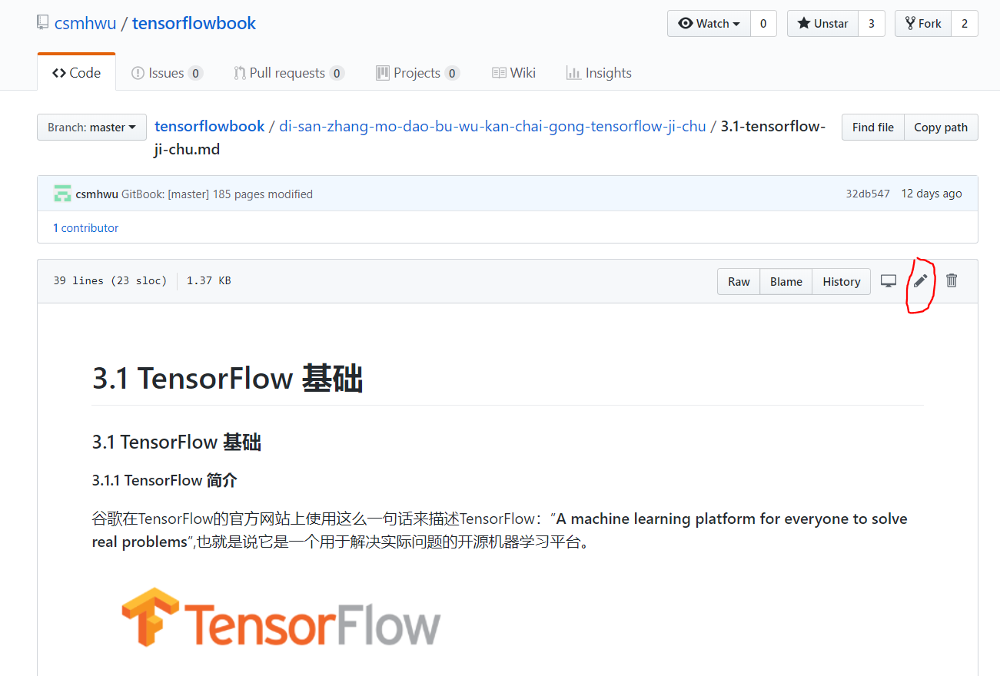

# 4.8 线性回归问题TensorFlow实战

#### 4.8.1 核心步骤

使用TensorFlow进行算法设计与训练有以下四个核心步骤：

（1）准备数据

（2）构建模型

（3）训练模型

（4）进行预测

上述步骤是我们使用TensorFlow进行算法设计和训练的核心步骤，贯穿于后面介绍的具体实战中，本章用一个简单的例子来讲解这几个步骤。

#### 4.8.2 准备数据

本例通过生成人工数据集。随机生成一个近似采样随机分布，使得w=2.0, b=1, 并加入一个噪声，噪声的最大振幅为0.4。

下面我们来展示具体代码。

#### 

